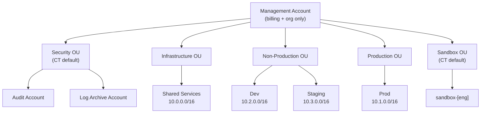

# AWS Account Setup

To provision and govern accounts at scale AWS recommends **AWS Control Tower** —
a managed service that sets up a secure multi-account environment, providing
a pre-configured landing zone, guardrails, and automated account vending out
of the box. Within Control Tower, **Account Factory for Terraform (AFT)** is
the mechanism that creates each account and immediately applies the full
Terraform baseline — VPC, subnets, security services, and cluster
configuration — so every account lands in a known, reproducible state with
no manual steps.

Control Tower creates the **Security OU** and **Sandbox OU** by default; we
add three custom OUs: **Infrastructure**, **Non-Production**, **Production**.

## Organization diagram

## Accounts

| OU | Account | Purpose | VPC CIDR |
|---|---|---|---|
| (root) | Management | Billing + org management only, no workloads | None |
| Security *(CT default)* | Audit | CloudTrail org trail, Config, Security Hub master | None |
| Security *(CT default)* | Log Archive | Centralized immutable logs (S3 Object Lock, 7yr) | None |
| Infrastructure | Shared Services | Transit Gateway, ECR, CI/CD, observability | 10.0.0.0/16 |
| Non-Production | Dev | Active development, experimental, liberal permissions | 10.2.0.0/16 |
| Non-Production | Staging | Pre-production mirror, stricter, closer to prod | 10.3.0.0/16 |
| Production | Prod | Production workloads | 10.1.0.0/16 |
| Sandbox *(CT default)* | sandbox-[eng] | Budget-capped engineer experiments | Own, no TGW |

## Why this structure

- **Account-per-environment** — blast-radius containment; a bad deploy or runaway
  cost in non-prod cannot touch production.
- **Separate Shared Services** — networking (TGW) and CI/CD must not live inside a
  workload account.
- **Control Tower Security OU left as-is** — Audit and Log Archive accounts are
  CT-owned; don't modify them directly.

## Growth path

When teams grow, split the single Prod account into per-domain accounts *inside*
the Production OU. The OU structure stays the same — just add accounts and attach
them to the Transit Gateway. No redesign needed.

## Account baseline (how each new account gets its VPC)

With Control Tower there is **no default VPC**, so networking is built by the
vending pipeline. **Account Factory for Terraform (AFT)** runs Terraform after each
account is created, in two layers:

| Layer | Applied to | Contains |
|---|---|---|
| **Global customizations** | Every account | Reusable VPC module: 3 public + 3 private subnets, IGW, NAT (per AZ), tiered route tables, TGW attachment. The pattern from `transit-gateway.md`. |
| **Account customizations** | Specific accounts (by name/tag) | Per-account differences: which CIDR, whether to attach to the TGW, prod vs non-prod sizing. |

Vending flow:

1. AFT creates the account via Control Tower and applies the Control Tower baseline.
2. AFT runs **global** then **account** customizations → VPC, subnets, IGW, NAT,
   route tables, TGW attachment all built to spec.
3. Result: every account lands with an identical, reproducible network — no manual
   VPC setup, no default VPC.

So the subnet/route-table/IGW/NAT layout is **not** created by default — it's
codified once in the AFT global customization module and applied automatically to
every new account.

## Governance summary

- **SCPs** — deny non-EEA regions, deny disabling CloudTrail/GuardDuty/Config,
  deny public S3, require KMS encryption, force IdP federation (no IAM users),
  deny leaving the org.
- **Identity** — Corporate IdP → IAM Identity Center → Permission Sets. No IAM
  users in workload accounts.
- **Regions** — primary `eu-central-1`, DR `eu-west-1`, all non-EEA regions blocked
  by SCP (EEA data residency).
- **Account vending** — new accounts via Account Factory for Terraform in < 30 min,
  with baseline guardrails auto-applied.

---

## Why sections

## Why Control Tower over plain AWS Organizations

AWS Organizations provides raw primitives only — you would need to build and
maintain your own CI/CD pipeline to apply SCPs, enroll accounts in security
services, and vend new accounts. Control Tower removes that need:

- **Managed landing zone** — Security OU, Audit/Log Archive accounts, and baseline
  guardrails set up automatically.
- **Account Factory** — new accounts are created with the full baseline already
  applied; no pipeline needed for the infrastructure baseline.
- **Guardrails** — preventive (SCPs) and detective (Config rules) controls managed
  by AWS, not your team.
- **AFT on top** — extends Control Tower with Terraform to add custom networking
  per account, triggered automatically on account creation.
