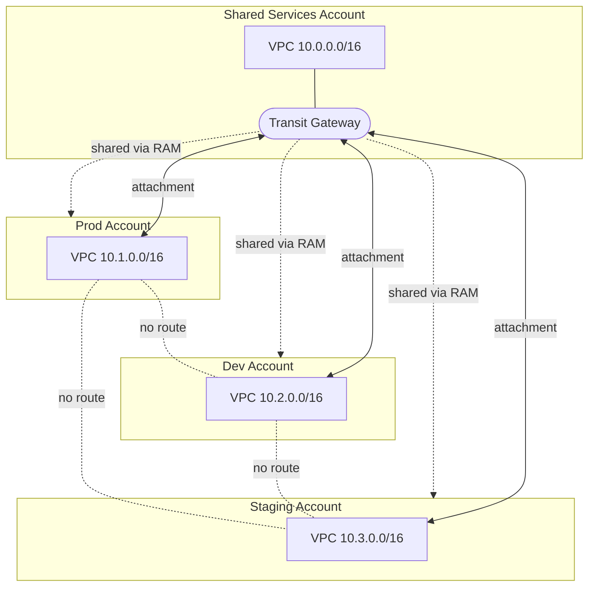
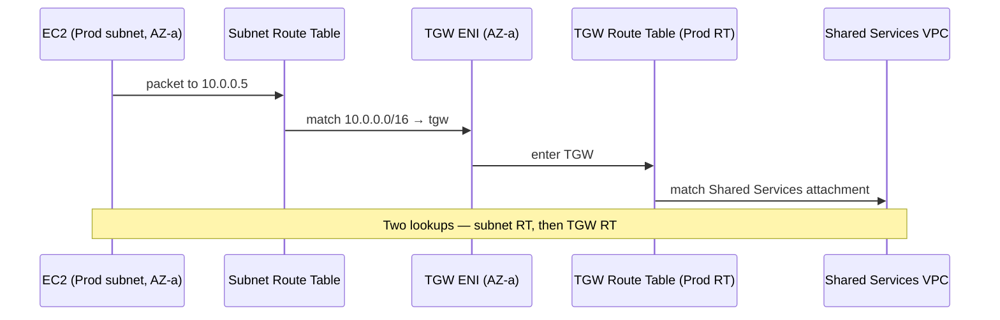

# Transit Gateway Connectivity

Each account owns its **own VPC**. A **central Transit Gateway (TGW)** lives in the
**Shared Services** account and is **shared to the organization via AWS RAM**.
Accounts attach **only when they need connectivity** — isolated by default.

## Connectivity diagram

All spokes reach the hub (Shared Services); the dotted lines mark that prod, dev,
and staging **cannot** reach each other — no routes exist between them at the TGW.

## How it works

1. **Share** — Shared Services account shares the TGW to the org via AWS RAM.
2. **Attach** — each account creates a VPC attachment to the shared TGW, selecting
   one subnet per Availability Zone.
3. **Route** — routes are added on both the VPC side and the TGW side (see below).

The TGW lives in the Shared Services account. Central routing control stays there.

## Prod, Dev and Staging — VPC, Subnets and Route Tables

Each account has a **single VPC** spanning 3 AZs with 5 subnet tiers (15 subnets
total) and **4 route tables**, one per tier:

- **Public RT** — routes internet traffic to the IGW.
- **Private RT** — routes cross-account traffic to the TGW and egress to the NAT Gateway.
- **Database RT** — routes cross-account traffic to the TGW; no internet access.
- **Intra RT** — local VPC traffic only; no internet, no TGW.

All networking is created automatically by **AFT** as part of the Control Tower
account vending pipeline.

**NAT Gateway strategy:**

- **Prod and Staging** — one NAT Gateway per AZ (3 total) for full Multi-AZ
  resilience and no cross-AZ egress costs.
- **Dev** — one shared NAT Gateway in a single AZ to save ~$64/month. Dev does
  not require high availability for egress. This is the only routing difference
  between Dev and Prod/Staging.

### Subnet layout

| VPC | Tier | Subnets (AZ-a / b / c) | Hosts | Route table entries |
|---|---|---|---|---|
| Prod 10.1.0.0/16 | Public /22 | 10.1.0.0/22 · 10.1.4.0/22 · 10.1.8.0/22 | 1,019 | `local`; `0.0.0.0/0 → IGW` |
| Prod 10.1.0.0/16 | Private /22 | 10.1.128.0/22 · 10.1.132.0/22 · 10.1.136.0/22 | 1,019 | `local`; `10.0.0.0/16 → tgw`; `0.0.0.0/0 → NAT` |
| Prod 10.1.0.0/16 | Database /22 | 10.1.16.0/22 · 10.1.20.0/22 · 10.1.24.0/22 | 1,019 | `local`; `10.0.0.0/16 → tgw` |
| Prod 10.1.0.0/16 | Intra /22 | 10.1.32.0/22 · 10.1.36.0/22 · 10.1.40.0/22 | 1,019 | `local` only |
| Dev 10.2.0.0/16 | Public /22 | 10.2.0.0/22 · 10.2.4.0/22 · 10.2.8.0/22 | 1,019 | `local`; `0.0.0.0/0 → IGW` |
| Dev 10.2.0.0/16 | Private /22 | 10.2.128.0/22 · 10.2.132.0/22 · 10.2.136.0/22 | 1,019 | `local`; `10.0.0.0/16 → tgw`; `0.0.0.0/0 → NAT` |
| Dev 10.2.0.0/16 | Database /22 | 10.2.16.0/22 · 10.2.20.0/22 · 10.2.24.0/22 | 1,019 | `local`; `10.0.0.0/16 → tgw` |
| Dev 10.2.0.0/16 | Intra /22 | 10.2.32.0/22 · 10.2.36.0/22 · 10.2.40.0/22 | 1,019 | `local` only |
| Staging 10.3.0.0/16 | Public /22 | 10.3.0.0/22 · 10.3.4.0/22 · 10.3.8.0/22 | 1,019 | `local`; `0.0.0.0/0 → IGW` |
| Staging 10.3.0.0/16 | Private /22 | 10.3.128.0/22 · 10.3.132.0/22 · 10.3.136.0/22 | 1,019 | `local`; `10.0.0.0/16 → tgw`; `0.0.0.0/0 → NAT` |
| Staging 10.3.0.0/16 | Database /22 | 10.3.16.0/22 · 10.3.20.0/22 · 10.3.24.0/22 | 1,019 | `local`; `10.0.0.0/16 → tgw` |
| Staging 10.3.0.0/16 | Intra /22 | 10.3.32.0/22 · 10.3.36.0/22 · 10.3.40.0/22 | 1,019 | `local` only |

- **Public** — hosts NAT Gateways (one per AZ) and internet-facing load balancers.
- **Private** — app and container workloads; egress via NAT, cross-account via TGW.
- **Database** — RDS, ElastiCache; no NAT, TGW route present for cross-account access from Shared Services.
- **Intra** — internal-only resources that must never reach the internet or other accounts; `local` route only.
- Internet egress goes out each VPC's **own NAT/IGW — not through the TGW**.

## Shared Services — VPC, Subnets and Route Tables

Single VPC spanning 3 AZs with 2 subnet tiers (6 subnets total) and **2 route
tables**, one per tier:

- **Public RT** — routes internet traffic to the IGW.
- **Private RT** — routes cross-account traffic to the TGW and egress to the NAT Gateway.

Shared Services has no database or intra tiers — it hosts platform tooling only.
Since Prod connects to Shared Services, it applies the same NAT strategy as Prod
and Staging — **one NAT Gateway per AZ** (3 total) for full Multi-AZ resilience.

| Tier | Subnets (AZ-a / b / c) | Hosts | Route table entries |
|---|---|---|---|
| Public /22 | 10.0.0.0/22 · 10.0.4.0/22 · 10.0.8.0/22 | 1,019 | `local`; `0.0.0.0/0 → IGW` |
| Private /22 | 10.0.128.0/22 · 10.0.132.0/22 · 10.0.136.0/22 | 1,019 | `local`; `10.1.0.0/16 → tgw`; `10.2.0.0/16 → tgw`; `10.3.0.0/16 → tgw`; `0.0.0.0/0 → NAT` |

Each `/22` has 1,024 IPs total, leaving **1,019 usable**. AWS reserves 5 addresses
from every subnet regardless of size:

| Address | Reserved for |
|---|---|
| First (e.g. 10.1.0.0) | Network address |
| Second (e.g. 10.1.0.1) | AWS VPC router |
| Third (e.g. 10.1.0.2) | AWS DNS |
| Fourth (e.g. 10.1.0.3) | AWS future use |
| Last (e.g. 10.1.3.255) | Broadcast (not supported in VPC, still reserved) |

## TGW route tables — hub-and-spoke isolation

The TGW lives in the Shared Services account and is shared to all accounts via
AWS RAM. Each VPC attachment is associated with its own TGW route table to enforce
network isolation between environments. When a packet arrives at the TGW from an
attachment, the TGW looks up the destination IP in that attachment's route table and
forwards the packet to the matching target attachment. If a destination CIDR is not
listed, the traffic is dropped at the TGW.

Three route tables, each showing its actual entries (`Destination CIDR → Target
attachment`):

**Prod RT** — associated with: Prod attachment

| Destination | Target attachment |
|---|---|
| 10.0.0.0/16 | Shared Services |

**Dev RT** — associated with: Dev attachment

| Destination | Target attachment |
|---|---|
| 10.0.0.0/16 | Shared Services |

**Staging RT** — associated with: Staging attachment

| Destination | Target attachment |
|---|---|
| 10.0.0.0/16 | Shared Services |

**Shared Services RT** — associated with: Shared Services attachment

| Destination | Target attachment |
|---|---|
| 10.1.0.0/16 | Prod |
| 10.2.0.0/16 | Dev |
| 10.3.0.0/16 | Staging |

Each spoke RT holds **only** the hub CIDR (`10.0.0.0/16`), so a spoke can reach
Shared Services and nothing else. The hub RT holds all three spoke CIDRs, so Shared
Services reaches all of them. **No spoke RT contains another spoke's CIDR** — that's
what keeps prod, dev, and staging fully isolated from each other.

## Packet flow (cross-account)

For a packet leaving a Prod private subnet heading to `10.0.0.5` (Shared Services):

1. Instance sends packet to `10.0.0.5`.
2. Subnet route table matches `10.0.0.0/16 → tgw` → sent to the TGW ENI in the same AZ.
3. TGW checks **its own** route table (Prod RT) → forwards to Shared Services attachment.
4. Arrives in the Shared Services VPC.

Two lookups: the subnet's route table gets it to the TGW; the TGW's route table
decides where it goes next.

---

## Why sections

## Why TGW over the alternatives

- **VPC Sharing (RAM subnets)** — simplest, but weaker isolation; fine for 2–3 accounts.
- **VPC Peering** — point-to-point, non-transitive; gets messy at 5+ VPCs.
- **Transit Gateway** — chosen: isolation by default, central routing control,
  scales cleanly to 10x growth.

## Why NAT Gateway and IGW stay local to each VPC

The TGW's only job is cross-account connectivity. Internet egress is kept local
to each VPC for three reasons:

- **Cost** — TGW charges $0.02/GB processed. Routing internet traffic through it
  would double the cost (TGW + NAT). Local NAT means internet traffic never
  touches the TGW.
- **Blast radius** — a centralised NAT in Shared Services would take down internet
  access for all accounts if it failed. Per-VPC NAT isolates failures.
- **Scale** — a centralised egress VPC becomes a bottleneck at 10x traffic growth.
  Per-VPC NAT scales independently with each account.
