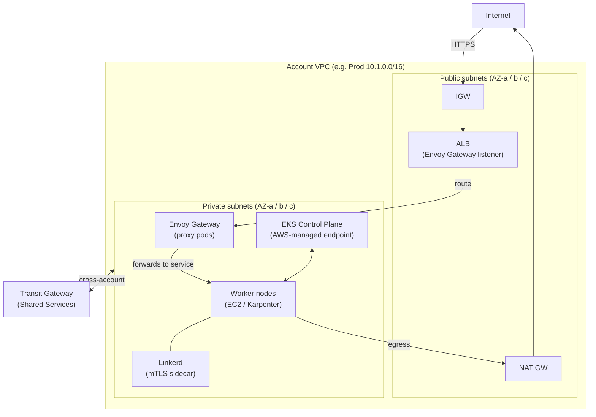

# Kubernetes (EKS)

One EKS cluster per environment — **Prod**, **Staging**, **Dev** — each living
inside that environment's account and VPC. Since each account already has a single
VPC with enough subnets and hosts (provisioned by AFT as described in
`2-networking.md`), the EKS cluster is placed directly into that VPC — no
additional networking is required. The cluster itself is also created with
**Terraform via AFT**, so every environment lands with an identical, reproducible
cluster with no manual steps.

## Cluster placement

Worker nodes run in the **private subnets**. Outbound internet access (image pulls,
API calls) goes via the VPC's NAT Gateway. The EKS control plane is managed by AWS
and communicates with nodes through the VPC endpoint — it is never reachable from
the internet.




## Cluster autoscaling — Karpenter vs Cluster Autoscaler

| | Cluster Autoscaler | Karpenter |
|---|---|---|
| Best for | Predictable, baseline workloads | Unpredictable / bursty workloads |
| How it works | Scales pre-defined node groups (ASGs) | Directly provisions EC2 instances; no node groups needed |
| Node groups required | Yes — must have ASG-backed Managed Node Groups | No — manages each EC2 instance directly, bypassing ASGs entirely |
| Example fit | Services with known baselines (e.g. ~128 GB RAM / 200 CPU steady state) | Batch jobs, ML inference spikes, queue-driven burst |
| Node consolidation | Basic scale-down | Aggressive bin-packing; replaces over-provisioned nodes automatically |

- If workloads have a known, stable baseline — Cluster Autoscaler is simpler to
  operate and reason about.
- If workloads are event-driven or highly variable — Karpenter provisions the
  right instance type in seconds and consolidates aggressively, reducing idle cost.

> **Karpenter note:** even though Karpenter does not require node groups for
> workload nodes, a small static Managed Node Group (e.g. 2× m5.large) is
> recommended for system pods — `coredns`, `kube-proxy`, and the Karpenter
> controller itself. This avoids a bootstrap problem where Karpenter cannot
> start because there are no nodes, and there are no nodes because Karpenter
> has not started.

## Pod autoscaling — HPA vs KEDA

| | HPA | KEDA |
|---|---|---|
| Scales on | CPU / memory (via metrics-server) | External events (SQS depth, Kafka lag, custom metrics, etc.) |
| Best for | CPU-bound or memory-bound stateless services | Queue consumers, batch workers, event-driven microservices |
| AWS integration | None built-in | Native ScaledObject for SQS, Kinesis, DynamoDB Streams, and more |

- HPA is the simpler choice for stateless HTTP services — scale on CPU/memory,
  no extra components needed.
- KEDA is the better choice when scaling decisions need to be driven by business
  metrics (e.g. messages waiting in an SQS queue) rather than resource utilisation.
- Both can coexist in the same cluster — HPA for the web tier, KEDA for the
  worker tier.

## EKS add-ons

| Add-on | Why |
|---|---|
| `vpc-cni` | AWS-native CNI; assigns pod IPs directly from the VPC CIDR; enables security-group-for-pods |
| `coredns` | In-cluster DNS; required for service discovery |
| `kube-proxy` | Manages iptables/ipvs rules for Services; required by EKS |
| `aws-ebs-csi-driver` | PersistentVolumes backed by EBS; required for stateful workloads (databases, Kafka, etc.) |
| `aws-efs-csi-driver` | PersistentVolumes backed by EFS with ReadWriteMany; required when multiple pods share a volume |
| `eks-pod-identity-agent` | Lets pods assume IAM roles without static credentials; node-local token exchange — simpler than IRSA |

## Pod IAM authentication

Pods that need to call AWS services (S3, SQS, DynamoDB, etc.) assume an **IAM
role bound to a Kubernetes service account** via **EKS Pod Identity**. The
`eks-pod-identity-agent` addon (already installed on every node) handles the
token exchange locally — no static credentials are stored in the pod or in
Kubernetes secrets. The IAM role and service account binding are defined in
Terraform and applied through AFT alongside the cluster.

## AFT provisioning

The EKS cluster and all add-ons above are declared in the AFT account
customization layer. Every new account gets an identical cluster automatically —
no manual steps after account vending. Cluster version upgrades are also managed
through the AFT module: bump the version variable, re-run, all clusters converge.

## External access — Kubernetes Gateway API with Envoy Gateway

For external (north-south) traffic into the cluster we use the
**Kubernetes Gateway API** with **Envoy Gateway** as the data-plane
implementation. Envoy Gateway runs Envoy proxy pods inside the cluster and
exposes services through the standard `Gateway`, `HTTPRoute`, and `GRPCRoute`
Kubernetes resources.

**Envoy Gateway is not an EKS managed addon** — it cannot be installed through
the `addons` block in the `terraform-aws-eks` module. Instead it is installed
using the **Terraform Helm provider** (`helm_release`), which means it is
provisioned as part of the same AFT Terraform run that creates the cluster:

```hcl
resource "helm_release" "envoy_gateway" {
  name             = "eg"
  repository       = "oci://docker.io/envoyproxy/gateway-helm"
  chart            = "gateway-helm"
  version          = "v1.x.x"
  namespace        = "envoy-gateway-system"
  create_namespace = true
}
```

The Helm chart installs both the Gateway API CRDs and the Envoy-specific CRDs
in one step. No separate pipeline or manual step is needed.

### Subnet tags required

The Kubernetes controllers that create load balancers (including Envoy Gateway's
provisioner and the AWS Load Balancer Controller) discover subnets by tag. These
tags must be added to the VPC in the AFT networking module:

| Subnet tier | Tag | Value | Purpose |
|---|---|---|---|
| Public | `kubernetes.io/role/elb` | `1` | Internet-facing load balancers |
| Private | `kubernetes.io/role/internal-elb` | `1` | Internal load balancers |
| Private | `karpenter.sh/discovery` | `<cluster-name>` | Karpenter node provisioning (if used) |

Without the `elb` / `internal-elb` tags the controller cannot discover which
subnets to place load balancers in and provisioning will fail.

## Service-to-service communication — mTLS

ISO 27001 and related security standards require that communication between
services is encrypted in transit. Implementing mTLS at the application level
is complex and error-prone — every service must manage certificates, handle
rotation, and enforce mutual authentication. We use **Linkerd** as the service
mesh to offload this entirely: mTLS is applied automatically at the network
layer, transparent to the application code. Linkerd is installed via a
`helm_release` in the AFT Terraform layer alongside the cluster.

## Why Linkerd over Istio

Linkerd is the simpler fit for this estate:

- **Automatic mTLS** — annotate a namespace and all pod-to-pod traffic is
  encrypted and mutually authenticated; no per-service certificate management.
- **Ultralight proxy** — Linkerd's data-plane proxy is written in Rust; far
  lower CPU and memory overhead than Istio's Envoy-based sidecar.
- **Built-in observability** — golden metrics (latency, success rate, RPS) are
  available out of the box; no extra components needed.
- **Operational simplicity** — single Helm chart, minimal CRDs, no control-plane
  tuning. Istio requires significantly more operational investment for features
  (circuit breaking, fault injection, WASM) that are not needed here.

---

## Why sections


## Why vpc-cni over Calico

`vpc-cni` is the default EKS CNI and the better fit for this AWS-native estate:

- **Real VPC IPs for pods** — pods appear directly in VPC routing; VPC flow logs,
  security groups, and network ACLs work without extra tooling.
- **Security groups for pods** — attach an EC2 security group directly to a pod
  for pod-level network isolation without a service mesh or separate policy
  controller.
- **No overlay** — Calico introduces a virtual network on top of the VPC.
  `vpc-cni` uses VPC routing natively — lower latency, one fewer layer to operate.
- **Operational simplicity** — one less component to version, patch, and monitor.
  Calico is worth considering only when you need NetworkPolicy features beyond
  what security groups provide; for most workloads `vpc-cni` is sufficient.

## Why Envoy Gateway is installed with Terraform and not a CD tool

The goal is for Terraform (via AFT) to produce a **fully operational cluster** —
including the networking layer — before any application deployment begins. Envoy
Gateway is infrastructure, not an application: it must exist before the first
`HTTPRoute` can route traffic, the same way the VPC must exist before the cluster.

Installing it with the Terraform Helm provider means:

- One `terraform apply` brings up the VPC, the EKS cluster, the managed add-ons,
  and the gateway layer together, in dependency order.
- The cluster is ready to accept application workloads immediately after vending
  — no follow-up manual step or bootstrap pipeline.

Application workloads — services, deployments, `HTTPRoute` definitions — are a
separate concern and will be managed by a CD tool such as **ArgoCD** or **Flux**
after the infrastructure is in place. This gives a clean boundary:
**Terraform owns the platform; the CD tool owns the apps.**

## Why EKS Pod Identity over IRSA

- **No OIDC provider per cluster** — IRSA requires creating an IAM OIDC identity
  provider for every cluster; Pod Identity uses a single
  `pods.eks.amazonaws.com` principal that works across all clusters with no
  per-cluster setup.
- **Simpler trust policies** — IRSA trust policies reference the cluster's OIDC
  URL and must be updated when clusters are recreated. Pod Identity trust
  policies are cluster-agnostic and never need changing.
- **AWS-recommended** — EKS Pod Identity is the current recommended approach
  for new clusters (Kubernetes 1.24+); IRSA remains supported but adds
  operational overhead that Pod Identity removes.
