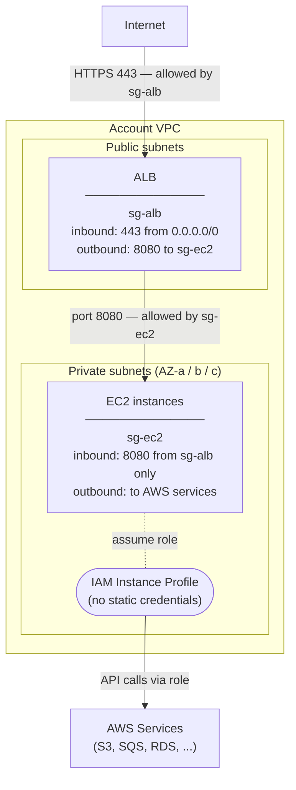

# EC2

EC2 instances are used for **stateful applications** — workloads that require
persistent local storage, specific OS-level configuration, or cannot run in a
container. All instances are provisioned by **Terraform via AFT** as part of the
account customization layer, consistent with how the VPC and EKS cluster are
vended.

## Placement

Instances run in the **private subnets**. They are never placed in public subnets
— there is no direct internet route to an EC2 instance in this estate.

If a workload needs to be reachable from outside the VPC, an **Application Load
Balancer (ALB)** is provisioned in the **public subnets** and targets the
instances in the private subnets. The instances themselves remain private.

## Access control

All inbound and outbound traffic is controlled by **security groups**. The
recommended pattern is security-group-to-security-group rules rather than CIDR
ranges — for example, the EC2 security group allows inbound on port 8080
**only from the ALB security group**. This means no traffic can reach the
instances directly, even from within the VPC, unless it comes through the ALB.

## AWS service access

If an EC2 instance needs to access another AWS service (S3, SQS, RDS, etc.),
this is done via an **IAM role attached to the instance through an instance
profile**. The instance assumes the role automatically — no static credentials
are stored on the instance. The IAM role and instance profile are defined in
Terraform and applied through AFT alongside the instance.

## Auto Scaling

An **Auto Scaling Group (ASG)** is optional and should be evaluated per workload.
For stateful applications, scaling must account for data replication and session
state — blind horizontal scaling can cause data inconsistency. Use ASG when the
stateful layer can handle concurrent instances safely (e.g. read replicas,
shared storage via EFS).

## Provisioning

EC2 instances, ASGs, launch templates, and the ALB are all defined in Terraform
and applied through the AFT account customization layer — the same pipeline that
creates the VPC and EKS cluster. No instances are created manually.

## Instance configuration

EC2 instances can be configured in two ways:

- **User data** — a script passed to the instance at launch time. Runs once when
  the instance first starts. Suitable for bootstrapping: installing packages,
  setting up agents, mounting volumes, or applying initial configuration before
  the instance serves traffic.
- **Ansible via CI/CD** — for ongoing configuration changes after launch, a
  CI/CD pipeline runs Ansible playbooks against the instance. This allows
  configuration to be updated without replacing the instance and keeps the
  desired state version-controlled and auditable.

