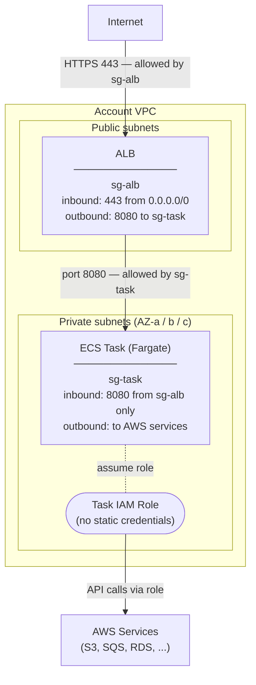

# ECS (Elastic Container Service)

ECS is a container orchestration service managed by AWS. It is an alternative to
Kubernetes for teams or workloads that do not need the full complexity of EKS.
Where EKS requires cluster management, node groups, add-ons, and Kubernetes
expertise, ECS is simpler to operate — AWS handles the control plane entirely.

## When to use ECS over EKS

- **Simpler workloads** — a service with a small number of containers and no
  need for advanced scheduling, custom controllers, or Kubernetes-native tooling.
- **Teams without Kubernetes expertise** — ECS has a much lower operational
  learning curve; no kubeconfig, no CRDs, no Helm charts.
- **Fargate-first** — ECS integrates natively with AWS Fargate, which removes
  node management entirely. There are no EC2 worker nodes to patch, scale, or
  right-size — you define CPU and memory per task and AWS runs it.
- **Batch and async workloads** — short-lived jobs that run and exit are simpler
  to model as ECS tasks than as Kubernetes Jobs.

## Placement and networking

ECS tasks run in the **private subnets**. For external access, an **ALB in the
public subnets** targets the ECS service. The same security-group-to-security-group
pattern applies: the task security group allows inbound **only from the ALB
security group** — no direct access to tasks is possible.

## IAM and access control

ECS tasks use a **task IAM role** to access AWS services without static
credentials — equivalent to EKS Pod Identity for Kubernetes pods and instance
profiles for EC2. The role is assumed automatically when the task starts.

## Provisioning

ECS clusters, task definitions, services, and IAM roles are provisioned by
**Terraform via AFT**, consistent with the rest of the estate.

However, this introduces a friction point: the **task definition references a
specific container image version**. Every time a new image is built and pushed,
the task definition must be updated. AFT is designed for infrastructure
provisioning, not for tracking application release cadence — keeping task
definitions in sync with new image versions requires either a separate CD
pipeline or manual Terraform updates, which adds operational overhead.

## Recommendation

If the estate already runs **EKS and EC2**, ECS adds a third orchestration model
with its own concepts, tooling, and operational surface without providing
capabilities not already covered. Prefer EKS for containerised workloads and
EC2 for stateful workloads. Introduce ECS only if there is a specific reason
it cannot be avoided (e.g. an existing ECS workload being migrated in).
