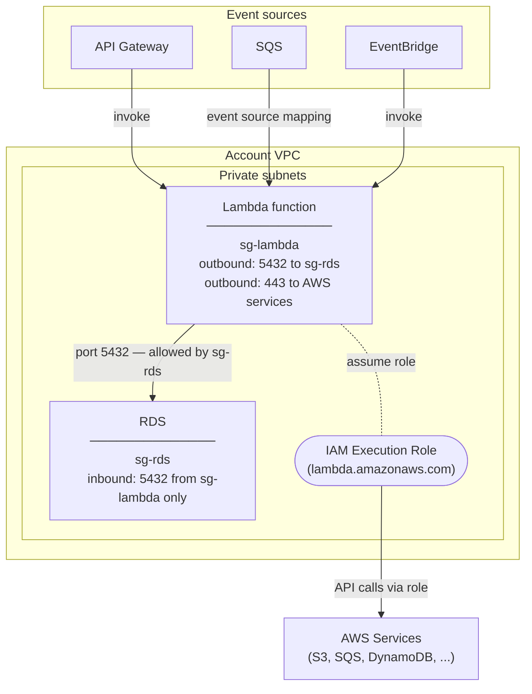

# Lambda

AWS Lambda runs code in response to events without provisioning or managing
servers. It is best suited for **short-lived, event-driven workloads** — glue
code, async processing, scheduled jobs, and API backends that do not need
persistent connections or long-running processes. Lambda functions are
provisioned by **Terraform via AFT** (`aws_lambda_function`) consistent with
the rest of the estate.

## VPC placement

Lambda functions are placed in the **private subnets**. Functions that need to
access resources inside the VPC (RDS, ElastiCache, internal services) connect
through the VPC automatically.

## Security groups

When a function is attached to a VPC, one or more **security groups** must be
specified. The Lambda security group controls what the function can reach inside
the VPC — for example, allowing outbound on port 5432 to the RDS security group
only. The target resource's security group allows inbound **only from the Lambda
security group**, so nothing else can reach it directly.

## IAM execution role

Every Lambda function has exactly one **IAM execution role** attached at the
function level. Lambda assumes the role automatically on invocation — no
credentials are stored in the function code. The role's trust policy must list
`lambda.amazonaws.com` as a trusted principal. Defined in Terraform and applied
through AFT.

## Event triggers

Lambda is invoked by events from other AWS services:

| Trigger | Invocation type |
|---|---|
| API Gateway / ALB | Synchronous |
| S3 | Asynchronous |
| SNS | Asynchronous |
| SQS | Polling (event source mapping) |
| EventBridge | Asynchronous |
| DynamoDB Streams / Kinesis | Polling (event source mapping) |

## Key limits

| Limit | Value |
|---|---|
| Max timeout | 15 minutes |
| Memory | 128 MB – 10,240 MB |
| Ephemeral storage (`/tmp`) | 512 MB – 10,240 MB |
| Container image size | 10 GB |
| Default concurrency | 1,000 per region (soft limit, increasable) |

A **cold start** happens when Lambda needs to initialise a new execution
environment for a function that has not been invoked recently. During this
initialisation, Lambda downloads the code, starts the runtime, and runs any
initialisation code outside the handler — which adds latency to that first
invocation. Subsequent invocations reuse the warm environment and are
significantly faster.
