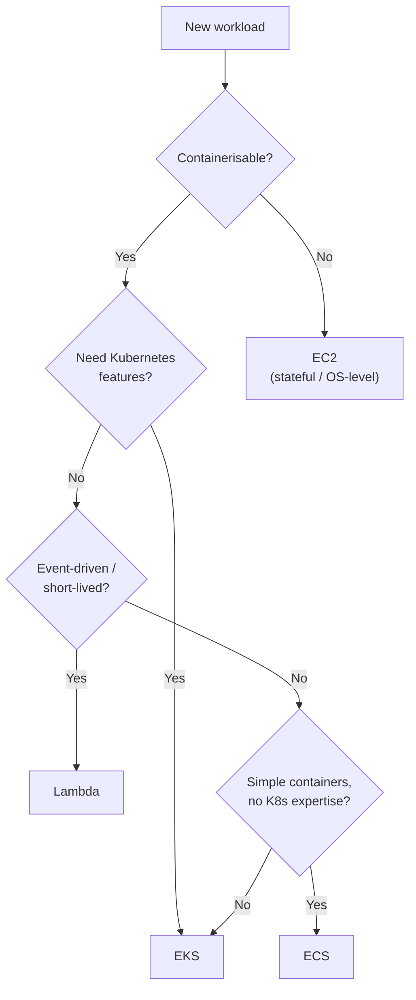

# Compute — Summary

| Service | Use for | Avoid when |
|---|---|---|
| **EKS (Kubernetes)** | Containerised workloads that need advanced scheduling, autoscaling, or Kubernetes-native tooling. The primary compute platform for this estate. | The team has no Kubernetes expertise and the workload is simple enough for ECS or Lambda. |
| **EC2** | Stateful applications that require persistent local storage, specific OS configuration, or cannot run in a container. | The workload is stateless and containerisable — use EKS instead. |
| **ECS** | Simpler containerised workloads where Kubernetes overhead is not justified, or teams without Kubernetes expertise. Fargate removes node management entirely. | EKS is already in the estate — ECS adds a third orchestration model without additional capability. Prefer EKS for new containerised workloads. |
| **Lambda** | Short-lived, event-driven workloads: async processing, glue code, scheduled jobs, API backends with no persistent connections. | The workload runs longer than 15 minutes, requires persistent connections, or has consistent high-throughput traffic — use EKS or EC2 instead. |

## Decision guide

