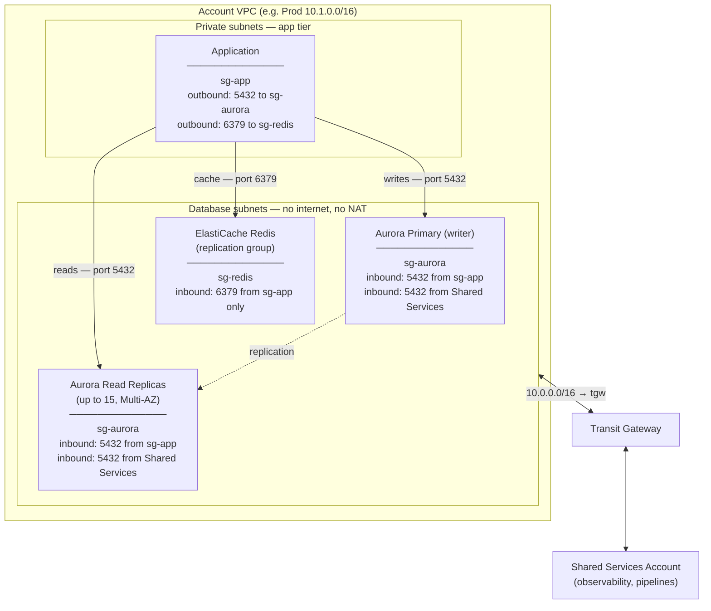
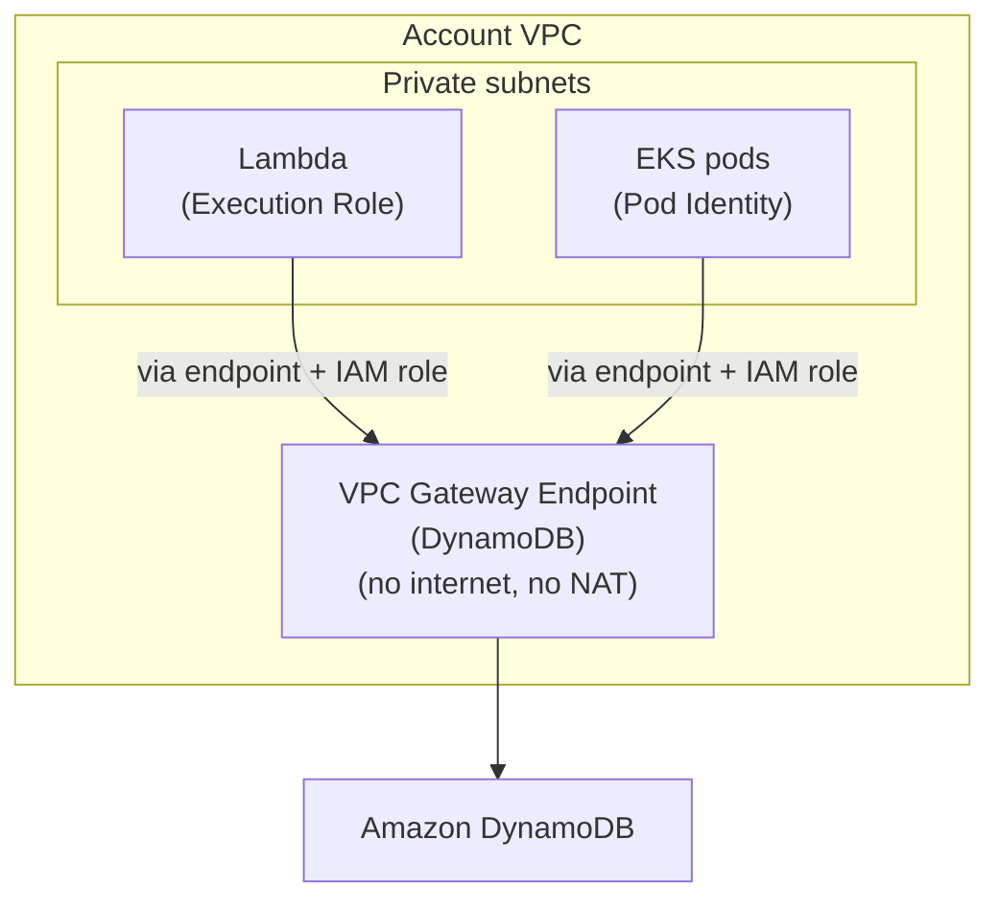
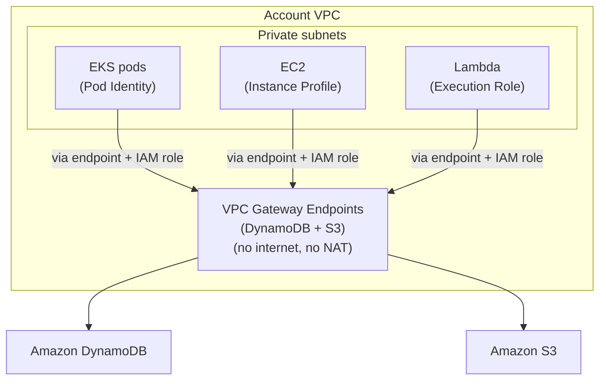

# Databases

All database services are provisioned by **Terraform via AFT** as part of the
account customization layer, consistent with the rest of the estate. Each
service is placed in the appropriate subnet tier defined in `2-networking.md`.

All traffic to database services stays within the AWS network — no data leaves
to the public internet. Aurora and ElastiCache live directly inside the VPC so
their connections are private by default. DynamoDB and S3 are regional AWS
services outside the VPC; they are accessed via **VPC Gateway Endpoints**
(free) which route traffic through the AWS backbone instead of the NAT Gateway.

## Amazon Aurora PostgreSQL

**Best suited for:** structured, transactional workloads — typically long-lived
connections from **EKS pods and EC2 instances** that need ACID guarantees,
relational queries, or complex joins.

Aurora is the primary relational database for structured, transactional
workloads. Each environment (Prod, Staging, Dev) has its own Aurora cluster
provisioned inside its VPC.

**Placement:** Aurora instances run in the **database subnets**
(`10.x.16.0/22 · 10.x.20.0/22 · 10.x.24.0/22`). These subnets have no NAT
and no internet route — only a TGW route (`10.0.0.0/16 → tgw`) for
cross-account access from Shared Services. The application tier in the private
subnets connects to Aurora via a **security group rule**. Services running in
the **Shared Services account** (e.g. observability tooling, shared pipelines)
can also reach Aurora over the Transit Gateway — the database subnet route
table already carries the Shared Services CIDR, and the Aurora security group
must include an explicit inbound rule for the Shared Services source.

**Multi-AZ:** Aurora replicates across all 3 AZs automatically. A failover to
a read replica completes in under 30 seconds — well within RTO ≤ 60 min.

**Read replicas:** Aurora supports up to 15 read replicas within the same
cluster. Read replicas serve read-heavy queries (reports, analytics, search)
directly — taking load off the primary writer without any extra infrastructure.
Replication lag is typically in the milliseconds. During a failover, Aurora
promotes the replica with the least lag automatically.

**Backup and recovery:**
- Automated backups with **Point-in-Time Recovery (PITR)** to any second
  within the retention window — meets RPO ≤ 15 min.
- Backup retention: 7 days (Prod), 3 days (Staging/Dev).

## Amazon ElastiCache for Redis

**Best suited for:** any compute tier (**EKS pods, Lambda, EC2**) that needs
sub-millisecond access to frequently read data — session tokens, rate-limit
counters, cached query results, leaderboards.

ElastiCache for Redis is an **application-level cache** that eliminates repeated
round-trips for frequently accessed data, delivering sub-millisecond response times.

**Placement:** database subnets, same tier as Aurora. Access is controlled
by a security group rule — only the application security group can reach port
6379.

**Multi-AZ:** deployed as a **replication group** with one primary and one or
more read replicas across AZs. Automatic failover promotes a replica if the
primary fails.

**Use cases:** query result caching, session storage, rate limiting, leaderboards.

**Backup:** Redis snapshots taken daily. The cache is rebuildable from the
database, so RPO for the cache tier is not a hard constraint.

## Amazon DynamoDB

**Best suited for:** **Lambda** is the natural pairing — both are serverless,
scale independently, and need no persistent connections. Also used by EKS pods
for high-throughput key-value lookups where a relational schema is not needed.

DynamoDB is used for **high-throughput key-value and document workloads** where
a relational schema is not needed — session data, feature flags, event metadata,
user preferences.

**VPC access:** DynamoDB is accessed via a **VPC Gateway Endpoint** — traffic
stays inside the AWS network and never traverses the internet or the NAT
Gateway. The endpoint is provisioned by AFT and added to the private and
database subnet route tables.

**IAM access:** every caller — EKS pod (via Pod Identity), EC2 instance (via
instance profile), or Lambda function (via execution role) — must have an IAM
policy granting the required DynamoDB actions. No static credentials are used.

**Scaling:** DynamoDB scales automatically with on-demand capacity mode —
no pre-provisioning needed for the 10× growth target.

**Backup:** PITR enabled, retaining 35 days of history with near-zero RPO.

**Best suited for:** **Data Firehose** landing Kinesis streams, **Lambda**
triggered on new object uploads, and all compute tiers writing backups, exports,
and audit logs.

S3 is used for **object storage, backups, and audit logs**. Aurora automated
backups and application-level exports land in S3.

**VPC access:** accessed via a **VPC Gateway Endpoint** — same pattern as
DynamoDB; no internet or NAT required.

**IAM access:** EKS pods (Pod Identity), EC2 instances (instance profile), and
Lambda functions (execution role) all access S3 through their attached IAM
role. No static credentials are used. The IAM policy scopes access to specific
buckets — e.g. the application role can write to its own bucket but not to the
log archive bucket.

## Backup and recovery summary

**RPO (Recovery Point Objective)** is the maximum acceptable data loss — how far back in time you may need to recover. **RTO (Recovery Time Objective)** is the maximum acceptable downtime — how long recovery can take before the service is back.

| Service | RPO | RTO | Mechanism |
|---|---|---|---|
| Aurora PostgreSQL | ≤ 1 min (PITR) | < 30 s (Multi-AZ failover) | Automated backups + PITR |
| DynamoDB | Near-zero (PITR) | Seconds (managed) | PITR, 35-day retention |
| ElastiCache Redis | Cache is rebuildable | < 60 s (replica promotion) | Replication group + daily snapshots |
| S3 | Near-zero | Immediate | 99.999999999% durability, versioning |

All services meet **RPO ≤ 15 min** and **RTO ≤ 60 min** requirements.

---

## Why sections

## Why Aurora over standard RDS

Standard RDS Multi-AZ is a valid option — it runs the same PostgreSQL engine and
also meets the RPO/RTO requirements. Aurora is preferred because:

- **Faster failover** — Aurora typically fails over in under 30 seconds; RDS
  Multi-AZ can take 1–2 minutes.
- **Storage auto-scales** — Aurora grows in 10 GB increments automatically up
  to 128 TB; RDS requires manual storage provisioning.
- **Better read throughput** — Aurora supports up to 15 read replicas vs 5 for
  RDS; important at 10× growth.

## Why Aurora provisioned over Aurora Serverless

Aurora Serverless v2 scales compute capacity automatically and is cost-effective
for intermittent or unpredictable workloads. Provisioned Aurora is preferred here
because:

- **Predictable performance** — a SaaS platform processing millions of events
  per hour has a known, stable baseline; provisioned instances deliver consistent
  latency without the warm-up delay of Serverless scaling.
- **Cost predictability** — provisioned capacity has a fixed hourly cost;
  Serverless can spike unexpectedly under burst load.
- **Connection handling** — provisioned Aurora handles persistent connection
  pools (from EKS pods, EC2) more predictably; Serverless scales in and out
  which can cause connection drops.

## Why DynamoDB over other NoSQL options

- **Serverless** — no cluster to provision, patch, or right-size; scales to 10×
  with zero infrastructure changes.
- **AWS-native** — native integrations with Lambda (event source mapping),
  Kinesis, and IAM; no extra drivers or connection management.
- **PITR built-in** — continuous backups with 35-day retention at no setup cost.

## Why ElastiCache over self-managed Redis

- **Managed Multi-AZ** — automatic replication and failover without operating
  Redis Sentinel or Cluster mode yourself.
- **Consistent with AFT** — provisioned by Terraform alongside the rest of the
  infrastructure; no separate runbooks for Redis.

## Why S3

S3 provides durable, cost-effective object storage for backups, audit logs,
and application exports. At 99.999999999% durability with native versioning,
it is the natural landing zone for all data that needs to be retained long-term
without running a dedicated storage service.
