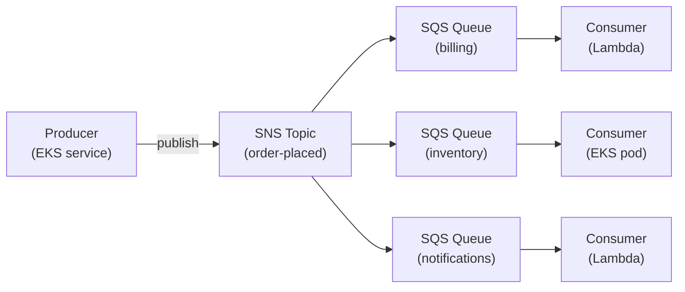
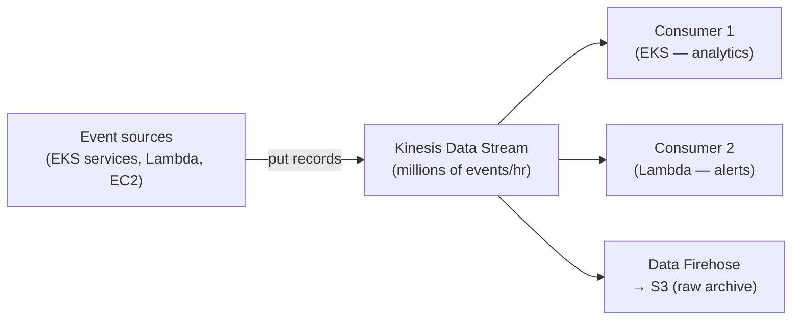

# Event Streaming & Messaging

Direct service-to-service calls create tight coupling — if the target service
is slow or unavailable, the caller fails too. A **message broker** sits between
services: the producer sends a message and moves on; the consumer reads and
processes it independently. This gives resilience (messages wait if the consumer
is down), back-pressure handling (the consumer processes at its own pace), and
decoupling (producer does not need to know who consumes the message).

All services below are managed by AWS and accessed from within the VPC — no
traffic leaves the AWS network. They are provisioned by **Terraform via AFT**.

---

## SQS — point-to-point queuing

**Amazon SQS** is the simplest form of async messaging: one producer puts a
message on a queue, one consumer reads and deletes it. The consumer pulls at
its own pace; if it is down, messages accumulate and are processed when it
recovers.

**Use cases:** background job processing, async task offloading, retry queues.

**Dead-letter queue (DLQ):** messages that fail processing repeatedly are
moved to a DLQ automatically — preventing poison-pill messages from blocking
the queue.

**Consumers:** EKS pods (via KEDA SQS scaler), Lambda (event source mapping),
EC2 workers.

---

## SNS — fanout pub/sub

**Amazon SNS** publishes one message to multiple subscribers simultaneously.
The standard pattern is **SNS → multiple SQS queues**: one event reaches every
interested service at the same time, each processing it independently at its
own pace.

**Use cases:** one event triggering multiple downstream services (e.g. "order
placed" → billing, inventory, notifications all receive it independently).

---

## Kinesis Data Streams vs Amazon MSK — high-throughput event streaming

For the platform's core requirement — **millions of events per hour, 10×
growth** — a dedicated event stream is needed. Both services provide ordered,
replayable streams where multiple independent consumers read the same events
at their own pace.

| | Kinesis Data Streams | Amazon MSK (Kafka) |
|---|---|---|
| Operations | Serverless — no cluster to manage | Managed Kafka cluster running in the VPC |
| Protocol | AWS-native SDK | Kafka client protocol |
| Scaling | On-demand mode scales automatically | Requires broker sizing and partition planning |
| Consumer model | Multiple consumers, each with own position | Consumer groups with partition assignment |
| Replay | 24 hours default, up to 365 days | Configurable retention per topic |
| Best for | AWS-native teams, greenfield | Teams with existing Kafka expertise or tooling |
| VPC placement | Interface endpoint | Runs directly inside VPC subnets |

**Recommendation:** start with **Kinesis Data Streams** — it requires no cluster
management and integrates natively with Lambda, EKS (via Kinesis client), and
Data Firehose. Move to MSK if teams bring Kafka expertise or need
Kafka-specific features (compacted topics, exactly-once transactions).

**Amazon Data Firehose** is a managed delivery pipeline that reads from the
stream, batches records, and lands them in S3 automatically — no consumer code
needed. It is the simplest way to durably archive every event without writing
or operating a dedicated consumer service.

---

## When to use which

| Pattern | Service | Example |
|---|---|---|
| Async task between two services | SQS | Image resize job, email send |
| One event → many services | SNS → SQS | Order placed, user registered |
| High-throughput ordered stream | Kinesis / MSK | Clickstream, metrics, audit events |
