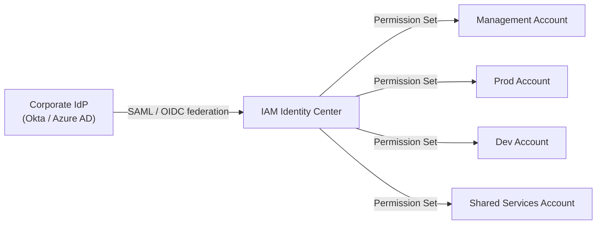
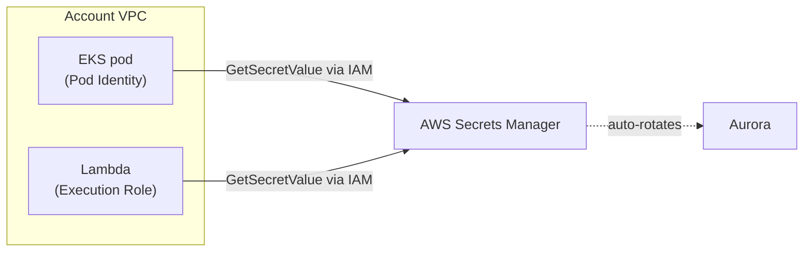
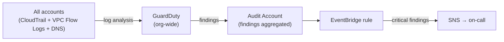

# Security & Identity

Security is enforced at every layer — identity, secrets, network, and detection.
All services are provisioned by **Terraform via AFT** and managed centrally from
the **Audit account** in the Security OU.

---

## IAM Identity Center — human access

Engineers never log in with IAM users. All human access flows through
**AWS IAM Identity Center** connected to the corporate Identity Provider (IdP):



**Permission Sets** define what a role can do — e.g. `ReadOnly`, `Developer`,
`PlatformAdmin`. Engineers assume a Permission Set into a specific account for
the duration of their session. No permanent IAM users exist in any account.

---

## IAM roles — machine access

No application credential is hardcoded. Every workload assumes an **IAM role**
at runtime; that role is the workload's identity for all AWS interactions.

| Compute | IAM mechanism |
|---|---|
| EKS pod | EKS Pod Identity (`eks-pod-identity-agent`) |
| Lambda | Execution role |
| EC2 | Instance profile |

**AWS service calls** (S3, DynamoDB, SQS, Kinesis, Secrets Manager, …) use the
IAM role directly. The SDK refreshes short-lived credentials automatically —
application code never handles tokens or keys.

**Aurora is the exception.** The application connects with a username and
password retrieved from Secrets Manager via `GetSecretValue` — using the same
IAM role. IAM database authentication is not used for Aurora because:

- Connection poolers (PgBouncer) cannot refresh 15-minute IAM tokens — every
  expiry would tear down the pool.
- RDS/Aurora IAM auth caps at 200 new connections per second per instance — a
  hard limit that becomes real at millions of events per hour.
- Secrets Manager with automatic rotation delivers the same "no long-lived
  secret" guarantee without either constraint.

The IAM role therefore serves both purposes: direct AWS service calls, and
retrieving the Aurora password from Secrets Manager.

---

## AWS Secrets Manager — application secrets

Applications retrieve secrets (database passwords, API keys, connection strings)
at runtime from **Secrets Manager** via their IAM role — no hardcoded credentials
in code or environment variables.

- Aurora credentials are **automatically rotated** by Secrets Manager on a
  configurable schedule — no manual password management.
- EKS pods retrieve secrets via Pod Identity; Lambda via execution role; EC2
  via instance profile.



---

## AWS KMS — encryption at rest

**Default principle: enable KMS encryption at rest on every resource that
supports it.** When provisioning any AWS service — Aurora, S3, EBS, SQS,
DynamoDB, Secrets Manager, ECR, EFS, Kinesis — always select a KMS key rather
than leaving encryption disabled or accepting an AWS-managed default. If a
service does not support KMS encryption, document the exception explicitly.

All data at rest is encrypted using **AWS KMS customer-managed keys (CMKs)**,
one key per environment. KMS integrates natively with Aurora, S3, EBS, and
Secrets Manager — encryption is transparent to the application.

- SCPs enforce KMS encryption — unencrypted resources cannot be created.
- Key access is controlled by IAM policies; the Management account cannot
  decrypt workload data.

---

## Services enabled by Control Tower by default

When Control Tower sets up the landing zone the following security services are
activated automatically across the organisation with no additional
configuration.

### AWS CloudTrail

Organisation-level trail — every AWS API call in every account and every
governed region is logged to the Log Archive account. Logs are written to S3
with Object Lock (immutable, 7-year retention).

**Example:** an engineer in the Dev account accidentally deletes an S3 bucket.
CloudTrail records the `DeleteBucket` call with the caller's identity,
timestamp, and source IP — giving a full audit trail for the incident.

### AWS Config

Organisation-wide configuration recording — tracks every resource change in
every account. Config evaluates rules continuously and flags non-compliant
resources.

**Example:** a developer creates an S3 bucket without KMS encryption. Config's
`s3-bucket-server-side-encryption-enabled` rule evaluates the bucket within
minutes and marks it NON_COMPLIANT, surfacing it in the Security Hub dashboard.

### S3 Log Archive

Immutable buckets in the Log Archive account that receive CloudTrail and Config
logs from all accounts. Object Lock prevents any principal — including the
Management account — from deleting or modifying log objects.

### SCPs

Preventive guardrails applied at the OU level — deny disabling CloudTrail or
Config, deny public S3 buckets, deny non-EEA regions, require KMS encryption,
deny IAM user creation.

**Example:** a developer tries to create an S3 bucket in `us-east-1`. The SCP
denying non-EEA regions blocks the API call immediately with an explicit deny
— the bucket is never created regardless of the developer's IAM permissions.

**Not enabled by default — require explicit activation:**
GuardDuty and Security Hub must be turned on separately after the
landing zone is created.

---

## AWS GuardDuty — threat detection

> **GuardDuty is not enabled by Control Tower** — it must be explicitly
> activated after the landing zone is created. The Management account designates
> the **Audit account** as the GuardDuty delegated administrator. From the
> Audit account, auto-enrolment is set to `ALL` so every existing and future
> member account is covered automatically. AWS explicitly recommends against
> using the Management account itself as the delegated administrator. Both the
> delegation and auto-enrolment are configured in the **AFT global
> customizations layer** so they are applied automatically on every new account.

**GuardDuty** continuously analyses CloudTrail logs, VPC Flow Logs, and DNS
queries across the entire organisation to detect threats — compromised
credentials, unusual API calls, port scanning, crypto-mining.

- Findings are aggregated in the **Audit account**.
- Optionally, an **EventBridge rule → SNS → on-call alert** can be configured
  for critical findings — this is not default AWS behaviour and must be set up
  explicitly.



### Example finding — EC2 port scan

An EC2 instance in the Prod account starts scanning ports on other instances
in the VPC — behaviour typical of a compromised host performing internal
reconnaissance.

GuardDuty raises:

```
Recon:EC2/PortProbeUnprotectedPort

Severity : MEDIUM
Account  : prod-account (123456789012)
Resource : EC2 Instance — i-0a1b2c3d4e5f
Detail   : EC2 instance is probing unprotected ports on multiple hosts
           within the VPC.
```

---

## AWS Security Hub — compliance dashboard

> **Security Hub is not enabled by Control Tower** — it must be explicitly
> activated. The **Audit account** must be designated as the Security Hub
> delegated administrator from the Management account, and auto-enrolment
> must be enabled so all member accounts report their findings centrally.
> Both the delegation and auto-enrolment are configured in the **AFT global
> customizations layer** so they are applied automatically on every new account.

**Security Hub** aggregates findings from GuardDuty and AWS Config
into a single dashboard in the **Audit account**. It runs continuous checks
against security standards (CIS AWS Foundations, AWS Foundational Security
Best Practices) and scores the estate's security posture.

### Example finding — publicly accessible S3 bucket

An S3 bucket in the Prod account has its Block Public Access setting disabled.
Security Hub raises:

```
[S3.2] S3 buckets should prohibit public read access

Severity : CRITICAL
Account  : prod-account (123456789012)
Resource : arn:aws:s3:::prod-customer-exports
Standard : AWS Foundational Security Best Practices v1.0.0
Detail   : The S3 bucket does not have block public access settings enabled.
           The bucket policy or ACL may allow public read access to objects.
```

The finding appears in the Audit account dashboard and, if the EventBridge
rule is configured, triggers an on-call alert.

---

## AWS WAF — web application firewall *(optional)*

AWS WAF can be attached to any internet-facing **ALB** in the estate to
filter malicious HTTP/S traffic before it reaches the application. It is not
required by default but is recommended for any ALB that is exposed to the
public internet.

When enabled, WAF rules are applied per ALB:

| Rule group | What it blocks |
|---|---|
| AWS Managed Rules — Core rule set | OWASP Top 10 (SQL injection, XSS, path traversal, etc.) |
| AWS Managed Rules — Known bad inputs | Exploits targeting common CVEs and log4j-style payloads |
| AWS Managed Rules — IP reputation | Requests from known malicious IPs and Tor exit nodes |
| Rate-based rule | Limits requests per IP per 5-minute window — protects against brute force and DDoS |

**How to set it up:** a WAF Web ACL is created and associated with the ALB
as part of the AFT account customization layer — the same Terraform run that
provisions the ALB. This ensures every internet-facing ALB in the estate
is protected consistently without manual steps. **AWS Firewall Manager** can
be used from the Management account to enforce a WAF policy organisation-wide,
automatically covering new ALBs as they are created.

---

## Why sections

### Why Secrets Manager over SSM Parameter Store

- **Automatic rotation** — Secrets Manager has native Lambda-based rotation for
  Aurora, RDS, Redshift, and DocumentDB. Parameter Store has no built-in rotation.
- **Purpose-built for secrets** — versioning, cross-account access, and audit
  logging are first-class features. Parameter Store is better suited for
  non-sensitive configuration values.

### Why GuardDuty at the organisation level

- **Zero configuration per account** — new accounts are enrolled automatically
  via the Management account delegated admin; no per-account setup needed.
- **Correlated signals** — org-level GuardDuty can detect lateral movement
  across accounts that per-account GuardDuty would miss.

### Why IAM Identity Center over IAM users

- **Federation** — engineers authenticate through the corporate IdP (Okta /
  Azure AD); all MFA, password policy, and offboarding are inherited from HR
  processes. No separate AWS credential lifecycle to manage.
- **Short-lived credentials** — every session assumes a temporary credential
  via a Permission Set; there are no long-lived access keys that can leak.
- **SCPs enforce it** — the SCP layer in Control Tower denies `iam:CreateUser`
  across all accounts, so IAM users cannot be created even accidentally.

### Why Security Hub over point-in-time audits

- **Continuous posture scoring** — Security Hub evaluates AWS Config rules and
  AWS Foundational Security Best Practices checks on every resource change, not
  just at audit time. A misconfigured S3 bucket is flagged within minutes.
- **Single aggregation point** — GuardDuty and Config findings all
  appear in one dashboard in the Audit account; no need to correlate findings
  from multiple consoles.

### Why Aurora uses Secrets Manager credentials, not IAM database authentication

IAM database authentication generates a short-lived token instead of a
password — which sounds more secure, but creates three practical problems at
this scale:

- **Connection poolers break.** PgBouncer (and most poolers) hold connections
  open; they have no mechanism to refresh an expiring IAM token. The 15-minute
  TTL forces reconnects that destroy pool efficiency.
- **200 connections/second cap.** Aurora enforces a hard limit on new IAM-auth
  connections per second. At millions of events per hour across many pods, this
  ceiling is reachable.
- **Equivalent security posture.** The benefit of IAM auth is eliminating a
  static password. Secrets Manager with automatic rotation achieves the same
  thing: the password changes on a schedule, so any compromised credential
  expires quickly. The application retrieves it via `GetSecretValue` — itself
  protected by the IAM role — so there is still no hardcoded secret anywhere.
