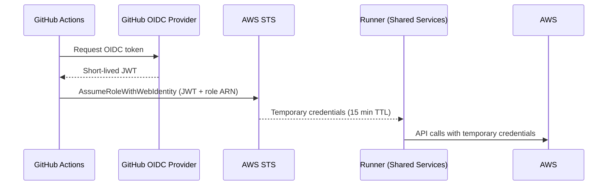
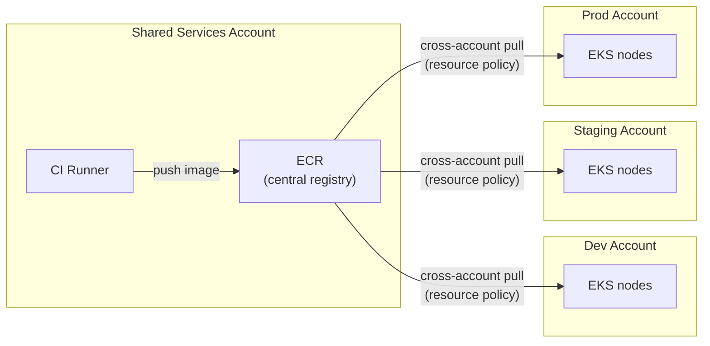
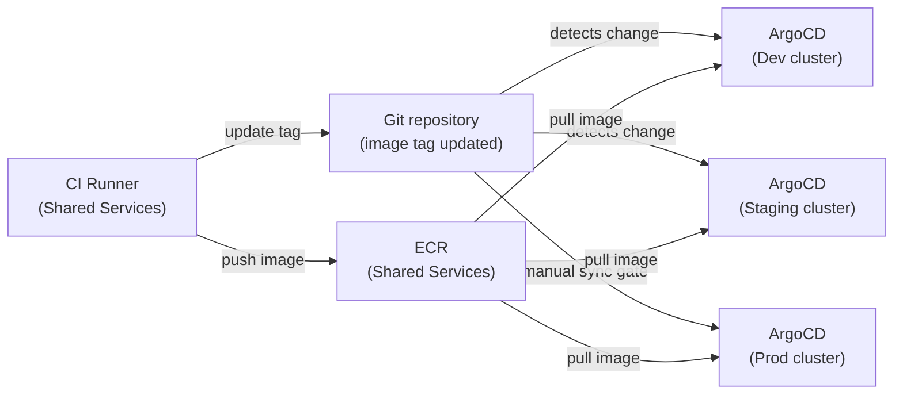
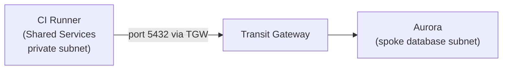

# CI/CD and Developer Experience

Source code lives in **GitHub** — the authoritative store for all application
and infrastructure code. GitHub predates the AWS estate; the CI/CD pipeline
is built around it rather than replacing it.

---

## Self-hosted runners in Shared Services

GitHub Actions **self-hosted runners** run inside the **Shared Services
account**, provisioned by **AFT** as part of the account customizations layer.
Runners run in the **private subnets** of the Shared Services VPC
(`10.0.128.0/22 · 10.0.132.0/22 · 10.0.136.0/22`) so they can reach all
spoke accounts via the Transit Gateway.

GitHub-hosted runners are not used because they have no VPC connectivity —
they cannot reach private resources such as Aurora in the database subnets
or cross-account services over the TGW.

### Runner isolation — non-prod vs prod

Two separate sets of runners enforce environment isolation:

| Runner set | Account access | Used for |
|---|---|---|
| **Non-prod runners** | Dev + Staging accounts only | Feature branches, PRs, staging deploys |
| **Prod runners** | Prod account only | Releases, production deploys |

A pipeline running on non-prod runners physically cannot access the Prod
account — the IAM role it assumes has no trust relationship with Prod. This
eliminates accidental production deploys from development pipelines.

---

## OIDC authentication — no static credentials

Runners authenticate to AWS accounts via **OpenID Connect (OIDC)** — no
long-lived access keys are stored in GitHub secrets. When a job runs, GitHub
issues a short-lived OIDC token; the runner exchanges it for temporary AWS
credentials by assuming an IAM role via `AssumeRoleWithWebIdentity`.

Each IAM role has a trust policy scoped to a specific GitHub organisation,
repository, and branch — a token from `myorg/frontend` on `main` cannot
assume the role used by `myorg/infra`.

---

## ECR — container image registry

**Amazon ECR** lives in the **Shared Services account** — one central registry
for all environments. The CI runner pushes images directly to ECR in the same
account (no cross-account push). EKS nodes in Dev, Staging, and Prod pull
images cross-account via an ECR **resource-based policy** that grants each
account's node IAM role pull access.

Images are built once and promoted by tag — the same image digest moves from
Dev → Staging → Prod without rebuilding. Image scanning runs once in Shared
Services and the result applies to all environments.

---

## Deployment to Kubernetes — ArgoCD

Application deployments to EKS clusters use **ArgoCD** installed directly
inside each cluster — one ArgoCD instance per environment (Dev, Staging, Prod).
ArgoCD is installed via Helm in the AFT account customizations layer alongside
the cluster, so every environment lands with it already running.

The CI pipeline builds and pushes a container image to **ECR in Shared
Services**, then updates the image tag in the Git repository. The ArgoCD
instance inside the cluster detects the change, pulls the image from ECR
cross-account, and reconciles the cluster state automatically.

Each ArgoCD instance only manages its own cluster — no cross-account API
server access is needed. Optionally, the Prod ArgoCD instance can be
configured with a **manual sync gate** so a human must approve before
changes are applied to production.

The CI runner never calls `kubectl` directly against any cluster — Git is the
only interface between the pipeline and the cluster.

---

## Deployment to EC2 — Ansible

EC2 instances are configured and deployed using **Ansible**, executed from
the CI runner in Shared Services. Ansible connects to instances over SSH
through the VPC — no public access is required since runners and instances
share the same TGW routing.

---

## Database access from Shared Services

CI/CD pipelines sometimes need direct access to Aurora — for example, to
run database migrations as part of a deployment. The networking already
supports this:

- The Shared Services private route table carries routes to all spoke VPCs
  via the TGW (`10.1.0.0/16`, `10.2.0.0/16`, `10.3.0.0/16`).
- The database subnet route table in each spoke account carries a return
  route to Shared Services (`10.0.0.0/16 → tgw`).
- The Aurora security group must include an explicit inbound rule allowing
  port 5432 from the Shared Services CIDR.

A migration job running on a Shared Services runner therefore connects to
Aurora over the TGW with no internet exposure.

---

## Why sections

### Why ECR in Shared Services over per-account registries

Per-account ECR would require the CI pipeline to push the same image to
multiple registries, or copy images between accounts on promotion — adding
pipeline complexity and storage cost. A single registry in Shared Services
means the image is built once: the same digest is promoted from Dev to Staging
to Prod by updating a tag in Git, with no rebuild and no copy. Image scanning
also runs once, and the result applies across all environments. This is
consistent with Shared Services already hosting the CI runners and the TGW.

### Why GitHub as the source of truth

Source code exists before the AWS estate is created. Building the pipeline
around where code already lives avoids migrating repositories, retraining
engineers, and breaking existing integrations for no architectural gain.

### Why self-hosted runners over GitHub-hosted runners

GitHub-hosted runners are ephemeral VMs with no VPC connectivity. They
cannot reach private resources — Aurora in a database subnet or cross-account
services over the TGW. Self-hosted runners in Shared Services have full
access to every spoke account's private subnets via the Transit Gateway
without any internet exposure.

### Why OIDC over static access keys

Static access keys are long-lived credentials that can leak through logs,
environment variables, or repository history. OIDC tokens are short-lived
(15 minutes), scoped to a specific repository and branch, and require no
secret rotation — GitHub manages the token lifecycle entirely. This is
consistent with the estate-wide principle of no long-lived credentials.

### Why one ArgoCD per cluster over a central instance

A central ArgoCD in Shared Services would require its own EKS cluster there,
plus cross-account access to each environment's Kubernetes API server — adding
cost and networking complexity that is not justified. Installing ArgoCD inside
each cluster keeps every environment self-contained: no extra infrastructure,
no cross-account API access, and a failure in one environment's ArgoCD has no
impact on the others. This is also consistent with the account isolation
principle used throughout the rest of the estate.
