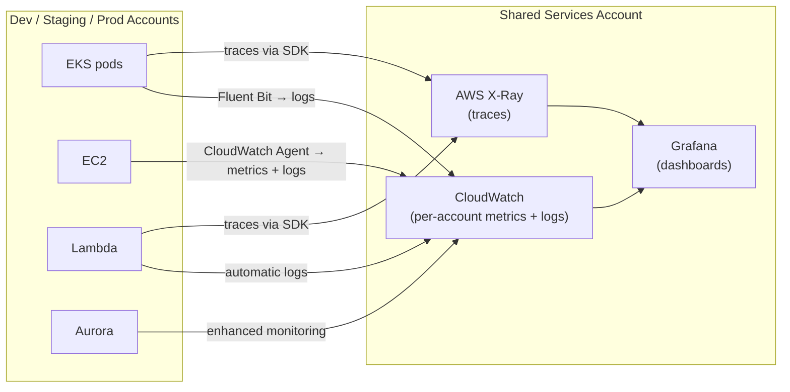

# Observability & Operations

Observability is built on three pillars — **metrics**, **logs**, and
**traces** — plus alerting on top. All tooling is provisioned by
**Terraform via AFT** and aggregated centrally in the **Shared Services
account** so engineers have a single place to monitor the entire estate.



---

## Metrics

**Amazon CloudWatch** is the primary metrics store. AWS services — Aurora,
Lambda, SQS, Kinesis, EKS nodes — emit metrics to CloudWatch automatically
with no instrumentation required.

**EKS application metrics** are collected by **CloudWatch Container Insights**,
which runs as a DaemonSet and captures CPU, memory, network, and disk metrics
per pod, node, and namespace. Linkerd (installed on every cluster) adds
**golden metrics** — latency, request rate, and success rate — for every
service-to-service call without any code changes.

**Grafana** runs in the Shared Services account and federates dashboards
across all accounts using CloudWatch as a data source. Engineers see metrics
from Dev, Staging, and Prod in one place without switching consoles.

---

## Logs

**Fluent Bit** runs as a DaemonSet on every EKS node and ships pod logs
directly to **CloudWatch Logs**, organised into log groups per cluster and
namespace:

```
/eks/<cluster-name>/<namespace>/<pod-name>
```

**EC2 instances** ship logs via the **CloudWatch Agent**, configured by AFT
as part of the account customization layer.

**Lambda** writes logs to CloudWatch Logs automatically — no agent needed.

**Log retention** is set per environment:

| Environment | Retention |
|---|---|
| Prod | 90 days |
| Staging | 30 days |
| Dev | 7 days |

Logs older than the retention window are exported to **S3** in the Log
Archive account for long-term storage at low cost.

---

## Traces

**AWS X-Ray** provides distributed tracing across EKS pods, Lambda
functions, and EC2 services. Applications instrument their code with the
**OpenTelemetry SDK**, which exports traces to the X-Ray daemon running
as a sidecar or DaemonSet. X-Ray stitches calls across service boundaries
into a full request trace, making it possible to see exactly where latency
is introduced across microservices.

---

## Alerting

**CloudWatch Alarms** watch key metrics and trigger an
**EventBridge rule → SNS → on-call tool** (PagerDuty, OpsGenie, or
similar) when thresholds are breached.

Standard alarms per environment:

| Signal | Threshold | Severity |
|---|---|---|
| Aurora CPU | > 80 % for 5 min | Warning |
| Aurora replica lag | > 1 s | Warning |
| EKS node CPU | > 85 % for 5 min | Warning |
| Lambda error rate | > 1 % | Critical |
| SQS DLQ depth | > 0 | Critical |
| Kinesis iterator age | > 5 min | Warning |

Linkerd's success rate metric is also wired to a CloudWatch Alarm — a
drop below 99.5 % for any service triggers an alert.

---

## Dashboards

Grafana in Shared Services provides three standard dashboard types:

- **Infrastructure dashboard** — EC2, EKS node, Aurora, and Lambda
  resource utilisation across all accounts.
- **Service dashboard** — Linkerd golden metrics (latency P50/P95/P99,
  RPS, success rate) per service and namespace.
- **Business dashboard** — Kinesis consumer lag, SQS queue depth, event
  throughput — the metrics that reflect the health of the product, not
  just the infrastructure.

---

## Optional path — Dynatrace or New Relic instead of X-Ray

If the organisation already has a Dynatrace or New Relic licence, or prefers
a full commercial APM platform over X-Ray, both are valid replacements.
Both support **OpenTelemetry natively via OTLP** — because the applications
are already instrumented with the OpenTelemetry SDK, switching backends
requires only a change to the exporter endpoint in the collector
configuration. No application code changes are needed.

| | AWS X-Ray | Dynatrace | New Relic |
|---|---|---|---|
| Protocol | AWS SDK / OTLP | OTLP (native) | OTLP (native) |
| Dashboards | Basic service map | Full APM + AI anomaly detection | Full APM + dashboards |
| Cost model | Pay per trace | Per host / DEM licence | Data ingest-based |
| AWS integration | Native | Via OTLP collector | Via OTLP collector |
| Operational overhead | None (managed) | SaaS — none | SaaS — none |

The recommended default remains X-Ray (zero additional cost, native AWS
integration). Dynatrace or New Relic are worth considering if the team
needs richer APM features — code-level profiling, anomaly detection, or
a unified commercial support contract covering traces, metrics, and logs.

---

## Why sections

### Why CloudWatch over a self-hosted Prometheus stack

Running Prometheus, Alertmanager, and a Thanos or Cortex layer for
multi-account aggregation adds significant operational overhead — cluster
storage, retention management, HA configuration. CloudWatch is fully
managed: it scales automatically, retains data without configuration, and
integrates natively with every AWS service. Grafana connects to CloudWatch
as a data source, so engineers still get the dashboarding experience they
expect without operating the metrics backend.

### Why Fluent Bit over Logstash or Fluentd

Fluent Bit is written in C — its memory footprint is an order of magnitude
smaller than Fluentd or Logstash on a per-node basis. At the scale of
millions of events per hour across many nodes, the resource saving is
meaningful. It is also the AWS-recommended log shipper for EKS and is
included in the AWS for Fluent Bit container image, which receives regular
security patches.

### Why OpenTelemetry over vendor SDKs

OpenTelemetry is the CNCF standard for instrumentation — the same SDK
exports traces to X-Ray today and to any other backend (Jaeger, Tempo,
Datadog) in the future without code changes. Instrumenting with a
vendor-specific SDK creates lock-in at the application layer; OpenTelemetry
keeps that decision reversible.
