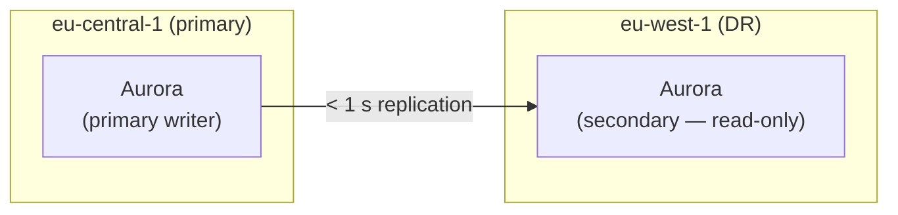
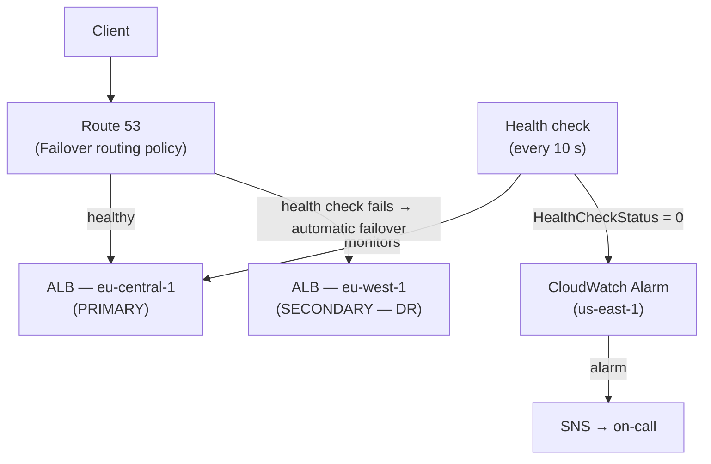

# Disaster Recovery Strategy

The DR strategy follows the **Pilot Light** pattern — a minimal but
pre-provisioned copy of production runs continuously in the DR region
(`eu-west-1`), with most compute scaled to zero to minimise cost. On
failure, compute scales up in minutes and the database is already live.

| Requirement | Target | Mechanism |
|---|---|---|
| RPO | ≤ 15 min | Aurora Global Database (< 1 s lag), DynamoDB Global Tables |
| RTO | ≤ 60 min | Pre-provisioned infra, EKS node scale-up, Route 53 failover |

---

## DR account

A dedicated **DR account** sits in the **Production OU**, provisioned by AFT
the same way as the primary Prod account. It receives the same Terraform
baseline — VPC, subnets, EKS cluster, ASGs, security groups — but all compute
starts at zero. Having a separate account gives clear cost visibility for DR
spend and keeps the DR environment isolated from the primary Prod account.

| | Primary | DR |
|---|---|---|
| Region | `eu-central-1` | `eu-west-1` |
| Account | Prod | DR (Production OU) |
| VPC CIDR | `10.1.0.0/16` | `10.4.0.0/16` |

---

## Component states at rest and on failover

### Compute — EKS

The EKS cluster is pre-provisioned in eu-west-1 by AFT, identical to the
primary cluster. A minimal **system node group** (1–2 small instances) runs
continuously to host system pods — ArgoCD, CoreDNS, and the autoscaler
controller. This is required regardless of the autoscaler choice.

For workload nodes, the DR state at rest depends on the autoscaler chosen
in the primary cluster:

- **Cluster Autoscaler** — Managed Node Groups are pre-provisioned with
  `min=0, desired=0`. No workload nodes run until the autoscaler reacts to
  pending pods.
- **Karpenter** — NodePools are defined but no EC2 instances exist. Karpenter
  provisions instances directly when pending pods appear.

On failover: Route 53 flips DNS to the DR ALB → ArgoCD syncs applications
from Git, creating pending pods → the autoscaler (whichever is in use) scales
up workload nodes (3–5 min) → pods schedule and start (2–5 min). Applications
are serving traffic within **~10 minutes**.

### Compute — EC2

Auto Scaling Groups are pre-provisioned with `min=0, desired=0`. Launch
templates and AMIs are already in place. On failover, ASG desired capacity
is raised and instances reach healthy state within 5–10 minutes.

### Compute — Lambda

Lambda functions are deployed to eu-west-1 via AFT. Lambda is regional —
functions are available immediately with no warm-up required.

---

## Data replication

### Aurora — Global Database

Aurora runs as a **Global Database** with eu-central-1 as the primary writer
and eu-west-1 as a read-only secondary. Replication lag is typically under
1 second — RPO is effectively near-zero.

On failover: the secondary is **promoted to primary** — this takes under
1 minute. The application in eu-west-1 connects to the eu-west-1 Aurora
cluster endpoint, which is already stored in the DR Secrets Manager secret.
The DR secret shares the same credentials as the primary but holds the
eu-west-1 endpoint — it is maintained separately and is not a direct
cross-region replica of the primary secret.

### DynamoDB — Global Tables

DynamoDB tables are configured as **Global Tables** with replicas in both
eu-central-1 and eu-west-1. Both replicas are active and writable at all
times — no promotion step is needed on failover.

### S3 — Cross-Region Replication

S3 buckets use **Cross-Region Replication (CRR)** to eu-west-1. Objects are
replicated asynchronously with typical lag of seconds.

### ElastiCache Redis

Redis is not replicated cross-region — the cache is rebuildable from Aurora
after failover. A cold cache adds temporary latency but does not affect
correctness or RPO.

### Secrets Manager — cross-region replication

Secrets in the primary Prod account that are **not endpoint-specific** (API
keys, third-party credentials) are replicated to the DR account via Secrets
Manager cross-region replication. Aurora connection secrets are managed
separately in the DR account with the eu-west-1 cluster endpoint — they are
not replicated from the primary, as the endpoint differs per region.

### ECR — cross-region replication

The central ECR registry in Shared Services (`eu-central-1`) replicates all
images to a DR ECR registry in eu-west-1 automatically using **ECR cross-region
replication**. DR EKS nodes pull images locally without crossing regions.

---

## Traffic failover — Route 53

**Route 53 Failover routing policy** is used. The
primary ALB in eu-central-1 is the `PRIMARY` record; the DR ALB in eu-west-1
is the `SECONDARY` record. A Route 53 health check monitors the primary ALB
endpoint every 10 seconds.

When the health check fails three consecutive times (30 seconds), two things
happen simultaneously:

1. Route 53 automatically routes all traffic to the DR ALB — no manual DNS
   change required.
2. A **CloudWatch Alarm** on the `HealthCheckStatus` metric fires and publishes
   to an **SNS topic**, sending an on-call alert to the engineer.

> **Note:** Route 53 health check metrics are always published to `us-east-1`
> regardless of the primary region. The CloudWatch Alarm must be created in
> `us-east-1`.

DNS TTL is set to **60 seconds** so clients pick up the change within 1 minute
of failover.

---

## Failover execution — GitHub Actions

The on-call engineer makes the **decision** to failover; a **GitHub Actions
workflow** (`workflow_dispatch`) executes all steps automatically in the
correct order. Running on the existing prod runners in Shared Services via
OIDC, the workflow:

1. Promotes the Aurora Global Database secondary to primary
2. Scales EC2 ASGs to desired capacity in the DR account
3. Triggers an ArgoCD sync on the DR cluster

The OIDC role for prod runners is extended with a dedicated DR permission
set — scoped only to the promotion and scale-up actions in the DR account.
No engineer runs CLI commands manually during the incident.

The GitHub Actions run log provides a full audit trail: who triggered the
failover, at what time, and the output of every step.

---

## Failover runbook (summary)

| Step | Action | Who | Time |
|---|---|---|---|
| 1 | Route 53 health check fails → DNS flips to DR ALB | Automatic | ~30 s |
| 2 | CloudWatch Alarm fires → SNS → on-call alert | Automatic | ~30 s |
| 3 | On-call engineer triggers GitHub Actions failover workflow | Human decision | — |
| 4 | Workflow promotes Aurora Global Database to primary | Automated (CI/CD) | < 1 min |
| 5 | Workflow scales EC2 ASGs up (if applicable) | Automated (CI/CD) | 5–10 min |
| 6 | ArgoCD syncs applications from Git → pending pods created | Automated (CI/CD) | 1–2 min |
| 7 | Autoscaler provisions workload nodes → pods start | Automated (autoscaler) | 3–5 min |
| **Total** | | | **~10–15 min** |

---

## Why sections

### Why Pilot Light over cold backup-and-restore

A cold restore — copying an Aurora snapshot to eu-west-1 and restoring it —
takes 30–90 minutes for a large database before any application can start.
This violates RTO ≤ 60 min. Pilot Light keeps the database secondary live
and the infrastructure pre-provisioned, so recovery is a scale-up operation,
not a rebuild.

### Why Aurora Global Database over cross-region snapshot copy

Snapshot copy replication introduces a data lag of minutes and a restore time
of tens of minutes. Aurora Global Database replicates continuously with under
1 second lag. Promotion is a single API call that completes in under 1 minute.
There is no other mechanism that meets RPO ≤ 15 min cross-region for a
relational database.

### Why Route 53 Failover routing over weighted routing

Weighted routing splits traffic by percentage — it is designed for
active/active or gradual traffic shifting, not for DR. Failover routing is
purpose-built for this scenario: 100% of traffic goes to the primary as long
as the health check passes, and switches to the secondary automatically when
it fails. No manual intervention or percentage adjustment is needed during
an incident.

### Why a dedicated DR account over reusing the Prod account

A separate DR account gives clear cost attribution for DR spend, blast-radius
isolation (a misconfiguration in DR cannot affect the live Prod account), and
a clean AFT baseline — the same account vending pipeline that creates Prod
creates DR, ensuring the two environments stay in sync as the infrastructure
evolves.
