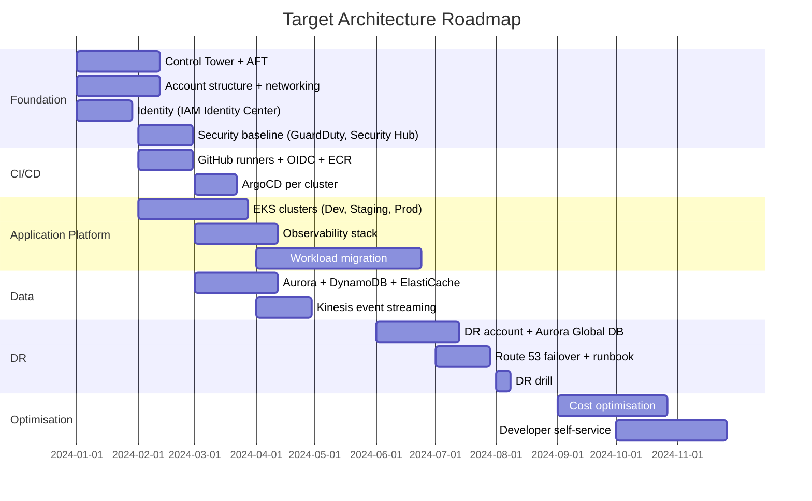

# Roadmap and Key Risks

---

## Roadmap

The migration from the current fragmented environment to the target
architecture is broken into five phases. Each phase delivers a usable
increment — teams are not blocked waiting for everything to be complete.

### Phase 1 — Foundation (weeks 1–6)

Establishes the platform everything else builds on. Nothing can be deployed
until this is in place.

- AWS Control Tower landing zone + AFT pipeline
- Account structure: Management, Security OU (Audit, Log Archive),
  Infrastructure (Shared Services), Non-Production (Dev, Staging),
  Production (Prod), DR (Production OU)
- Transit Gateway + VPCs in all accounts (AFT global customizations)
- IAM Identity Center connected to corporate IdP
- GuardDuty and Security Hub delegated to Audit account
- SCPs: deny non-EEA regions, deny public S3, require KMS, deny IAM users

**Milestone:** a new account can be vended in under 30 minutes with full
baseline applied automatically.

---

### Phase 2 — CI/CD and Application Platform (weeks 5–14)

Gives development teams a working deployment pipeline and a consistent
compute platform before workloads are migrated.

- GitHub self-hosted runners in Shared Services (OIDC, non-prod/prod split)
- ECR in Shared Services with cross-account pull
- EKS clusters in Dev, Staging, Prod — provisioned by AFT
- ArgoCD per cluster
- Observability: Fluent Bit, CloudWatch Container Insights, X-Ray, Grafana

**Milestone:** a developer can push code to GitHub and have it deployed to
Dev via ArgoCD without any manual steps.

---

### Phase 3 — Data and Event Streaming (weeks 9–18)

Migrates the data layer to the target services.

- Aurora PostgreSQL per environment (provisioned by AFT)
- ElastiCache Redis per environment
- DynamoDB Global Tables (eu-central-1 + eu-west-1 from the start)
- Kinesis Data Streams for high-throughput event processing
- Secrets Manager with automatic rotation wired to Aurora

**Milestone:** all production databases running on Aurora with PITR enabled
and secrets rotation confirmed working.

---

### Phase 4 — DR (weeks 22–30)

Implements the Pilot Light DR strategy once the primary environment is stable.

- DR account provisioned by AFT in eu-west-1
- Aurora Global Database secondary in eu-west-1
- S3 Cross-Region Replication, ECR cross-region replication
- Route 53 Failover routing policy + CloudWatch health check alarm (us-east-1)
- GitHub Actions failover workflow
- First DR drill — validate RTO ≤ 60 min and RPO ≤ 15 min end-to-end

**Milestone:** successful DR drill with documented RTO and RPO measurements.

---

### Phase 5 — Optimisation (weeks 36–52)

Focuses on cost, developer autonomy, and readiness for 10× growth.

- Right-size EC2 and EKS instances based on observed usage
- AWS Savings Plans or Reserved Instances for steady-state workloads
- Developer self-service: teams provision their own resources via AFT
  customization templates without platform team involvement
- Kinesis shard capacity and Lambda concurrency reviewed for 10× headroom
- Chaos engineering: inject failures to validate resilience and DR runbook

**Milestone:** platform team is no longer a bottleneck for new service
onboarding.

---

## Key risks

| # | Risk | Impact | Likelihood | Mitigation |
|---|---|---|---|---|
| 1 | **Workload migration downtime** — moving existing services to EKS/Aurora without disrupting live traffic | High | Medium | Migrate one service at a time; run old and new in parallel with feature flags until stable |
| 2 | **Team skill gaps** — engineers unfamiliar with EKS, Terraform, GitOps | High | High | Embed platform engineers with product teams during migration; provide internal training |
| 3 | **AFT pipeline complexity** — Terraform errors during account vending block new environments | Medium | Medium | Test AFT changes in a sandbox account before applying to production OUs |
| 4 | **Aurora Global Database promotion** — untested failover reveals application issues (connection string caching, retry logic) | High | Medium | DR drills every quarter; chaos injection in staging to validate application behaviour |
| 5 | **Cost overrun** — Aurora Global Database, NAT Gateways per AZ, and cross-region replication are significant line items | Medium | High | Tag all resources by environment and service; set AWS Budgets alerts per account |
| 6 | **EEA data residency breach** — a misconfigured service writes data to a non-EEA region | High | Low | SCP blocking non-EEA regions is the primary control; GuardDuty and Config rules provide detective coverage |
| 7 | **Shared Services as single point of failure** — CI/CD runners, ECR, and TGW all live there | High | Low | Multi-AZ within Shared Services; ECR cross-region replication means DR can pull images independently |
| 8 | **10× growth — Kinesis shard limits** — default shard capacity may be exhausted under burst load | High | Medium | Enable on-demand mode for Kinesis streams; monitor iterator age via CloudWatch |
| 9 | **GuardDuty / Security Hub not activated before workloads go live** — gap in threat detection during migration | Medium | Medium | Activate both services in Phase 1 before any workload account is created |
| 10 | **DR drill failure** — first real failover during an incident, not a drill | High | Medium | Schedule quarterly DR drills; automate drill execution via the same GitHub Actions workflow |

---

## Why sections

### Why a phased roadmap over a big-bang migration

A single cutover of all services simultaneously creates an unmanageable blast
radius — a single failure blocks everything. Phasing the migration means each
increment is independently testable, teams can start using the new platform
before it is complete, and failures are contained to one phase.

### Why DR drill in Phase 4 rather than after full completion

DR readiness is a hard requirement, not a nice-to-have. Delaying the drill
until after optimisation means the first real test of the failover procedure
could be during a live incident. Running a drill in Phase 4 — when the DR
infrastructure is first deployed — validates the RTO/RPO targets early and
surfaces application-level issues (connection string handling, retry logic)
while there is still time to fix them.
